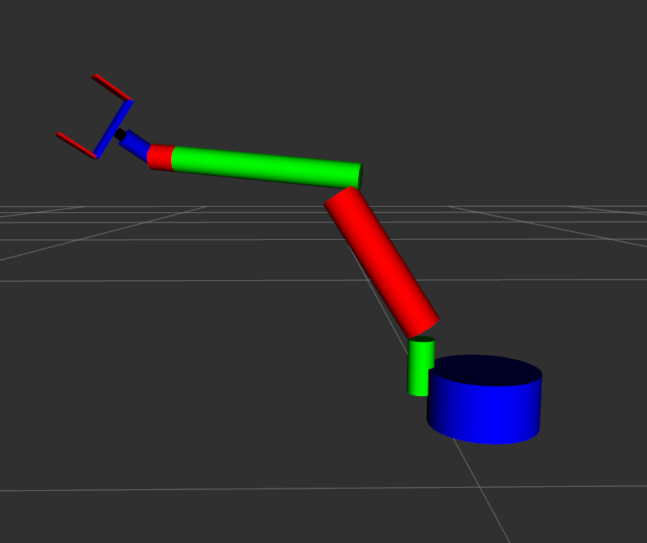
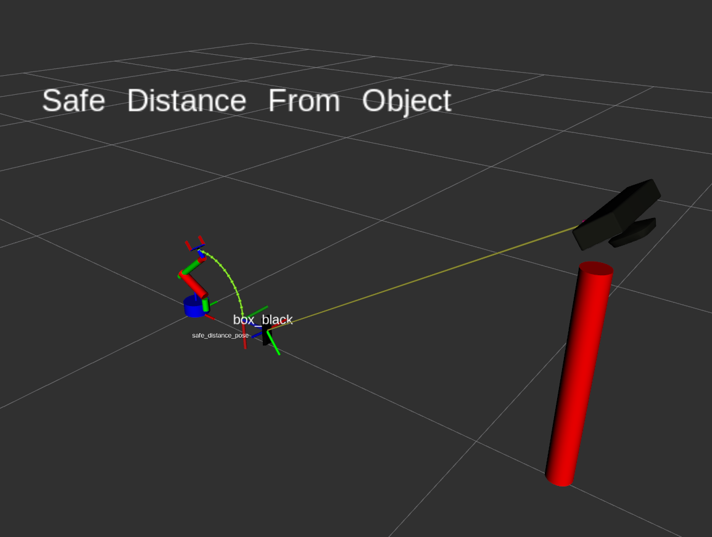
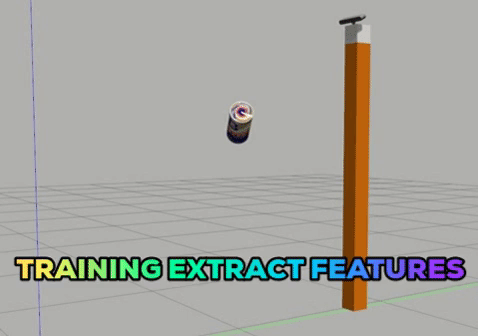
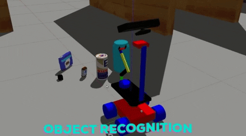

# Connect any Arm with ROS

**This Project is a KickOff Project of my Open Mobile Manipulator Project**

[Open Mobile Manipulator Project](https://github.com/panagelak/Open_Mobile_Manipulator)

## Description

**This project is meant to help you with connecting ANY DIY ARM with feedback or not to ROS , both in simulation and on reality!!**

## URDF

**The idea is that you can customize the  URDF of the arm to resemble your robot, IF you see  in the arm_description package on the robots folder there is a configuration file with some global properties that all the macros have access too, In order to easily change the properties of the arm.**

**I think i have made a good job of this**

## Hardware Interface

**I have used this hardware interface from  PickNikRobotics P.S I didn't fork in order to have it all in a single git repo sorry**

[Hardware Interface](https://github.com/PickNikRobotics/ros_control_boilerplate)

**Right now in the read and write function i have just include a passthrough code which assumes perfect execution with position**

**e.g joint_position_[joint_id] = joint_position_command_[joint_id];**

**With this you can move the robot using ONLY RViz with ros_control or MoveIt instead of using Gazebo and ros_control_plugin**

**If you then want to control a real robot arm without feedback all you have to do is to transform the joint_states into appropiate servo commands and send them to the robot for execution with e.g rosserial, I have included an example of such a node in the arm_bringup package and the corresponding arduino code in the data folder and how to launch them in the real_bringup.launch**

**I would also like to put a publisher and subscriber inside the hardware interface so you can do something similar with robot that have feedback on the servos or whatever. Not the fastest but it will work**

## 3D Perception

**I have Included a 3D Perception package sensor_stick it is a mod of the Udacity's Robotic's Nanodegree 3D Perception Project **

**The idea is that you capture features (hsv and surface normal features in a histogram format) in a Gazebo world and outputs a training_set.sav file**

**$ roslaunch sensor_stick training.launch**
**$ rosrun sensor_stick capture_features.py**

**Then with that features we train an SVM with linear kernel Classifier which outputs the classifier in a model.sav file**

 **$ rosrun sensor_stick train_svm.py**

**Then we can use this classifier in our perception pipeline e.g prefiltering -> segmentation -> classify -> publish tf and markers**

**$ roslaunch sensor_stick object_recognition.launch**

**P.S In order to run it you will need to be able to import pcl and sklearn in python2 (see my Open Mobile Manipulator Project on how to install pcl in python)**

### Install 3D Perception

**In your .bashrc**

export GAZEBO_MODEL_PATH=~/catkin_ws/src/arm/sensor_stick/models:$GAZEBO_MODEL_PATH

**Go to this package [RoboND-Install-PCL](https://github.com/udacity/RoboND-Perception-Exercises) clone in a different folder and follow the instruction there in order to install pcl**

**You will also need to install sklearn in python2**

## For simulation

**$ roslaunch arm_bringup sim_bringup.launch**

Gazebo world + Black Box + Robot description + Camera with Ros Controllers

**$ roslaunch moveit_interface moveit.launch**

Launches the MoveGroup

**$ rosrun moveit_interface set_start_pos.py**

Set's the arm to the start position

**$ roslaunch arm_viz rviz.launch config:=basic**

Launches RViz with a predefined configuration

## For real robot run the command

**$ roslaunch arm_bringup real_bringup.launch**

Launches the Robot Description + Robot Hardware Interface + Robot Controllers

**$ roslaunch moveit_interface moveit.launch**

**$ rosrun moveit_interface set_start_pos.py**

**$ roslaunch arm_viz rviz.launch config:=basic**

## Scripting

**Instead of opening multiple terminals and writing the commands 1 by 1**

**It is a good practice to use script files to launch automatically multiple terminals with your desired commands by simple running the script**

**Make sure you have installed xterm emulator**

**sudo apt-get update -y**

**sudo apt-get install -y x-terminal-emulator**

**also your scripts (and .py) files have permissions**

**chmod +x safe_spawner_basic.sh**

**To that end you can go to ( $ roscd safe_spawner ) there you will find some scripts - demos that you can run, for example**

**1. $ ./safe_spawner_basic.sh** :  Will launch the sim_bringup with an empty world + Moveit + Start pos + RViz

**2. $ ./safe_spawner_pseudo_real.sh**  Will launch real_bringup + moveit + rviz (SEE HOW THE ARM MOVES USING ONLY RViz)

**3. $ ./safe_spawner_object_recognition.sh**  Will launch sim_bringup + Moveit + Start pos + 3D Perception + Pick n Place Server + Pick n Place Client + Rviz (See 3D Perception + Click next in RViz)

**I will make more of this in the feature**
 
## Compiling

**mkdir -p ~/catkin_ws/src && cd catkin_ws/src**

**git clone** https://github.com/panagelak/Generic_Arm.git

**cd ~/catkin_ws**

**rosdep install --from-paths src --ignore-src -r -y** (install depedencies)

**catkin_make**

**Now theoritically it will be easy to compile the project in ROS Melodic, where you might find some problem in execution is with the sensor_stick package, you will need to be able to import in python pcl and sklearn**

## Arduino Code

**In the data folder you will find an example of an arduino code that you can use to control servos with the Servo library although the best option would be to use a PCA9685 i2c Servo driver for this purpose**

## Contact ME

**You can contact me at panagelak12@gmail.com or panagiotis.angelakis.robot@gmail.com**

**For more assembly details or questions**

**I will be happy to answer your questions don't be afraid!!!**

**Cheers**